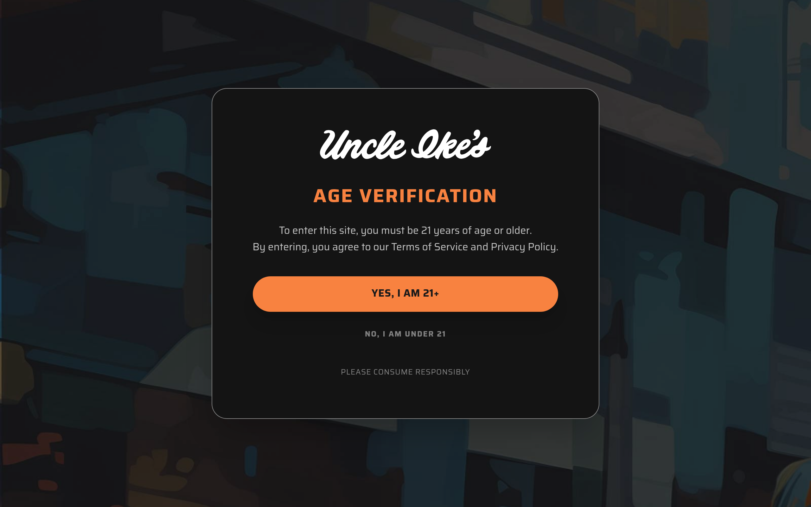

# ikes Design System

You are building UI for **ikes**. Light-themed, neutral palette, sans-serif typography (Saira), compact density on a 4px grid, expressive motion.

## Visual Reference

**IMPORTANT**: Study ALL screenshots below before writing any UI. Match colors, typography, spacing, layout, and motion exactly as shown.

### Homepage



> Read `references/DESIGN.md` for full token details.

## Design Philosophy

- **Layered depth** — use shadow tokens to create a sense of physical layering. Each elevation level has a specific shadow.
- **Gradient accents** — gradients are used thoughtfully for emphasis, not decoration.
- **Type pairing** — Saira for body/UI text, Futura for headings/display. Never introduce a third typeface.
- **compact density** — 4px base grid. Every dimension is a multiple of 4.
- **neutral palette** — the color temperature runs neutral, matching the sans-serif typography.
- **Expressive motion** — animations are an integral part of the experience. Use spring physics and layout animations.

## Color System

### Core Palette

| Role | Token | Hex | Use |
|------|-------|-----|-----|
| Background | `--background` | `#ffffff` | Page/app background |
| Surface | `--surface` | `#f1f1f1` | Cards, panels, modals |
| Text Primary | `--text-primary` | `#121212` | Headings, body text |
| Text Muted | `--text-muted` | `#bfc7ad` | Captions, placeholders |
| Border | `--border` | `#353b41` | Dividers, card borders |

### Status Colors

| Status | Hex | Use |
|--------|-----|-----|
| Danger | `#f88240` | Errors, destructive actions |

### Extended Palette

- **color-slate:** `#1d222c`
- **tw-ring-color:** `#6b7280`
- **color-canopy:** `#2f4257`
- **color-black:** `#000000` — Deep background layer or shadow color
- `#4a5565`
- **tw-ring-color:** `#5a6b70`
- **toastify-spinner-color:** `#616161`
- **color-primary-500:** `#9fa791`

### CSS Variable Tokens

```css
--toastify-toast-background: #fff;
--color-primary-900: #3d4235;
--color-primary-800: #525947;
--color-primary-700: #6b7360;
--color-primary-600: #858d78;
--color-primary-500: #9fa791;
--color-primary-400: #b3bba7;
--color-primary-300: #bfc7ad;
--color-primary-200: #d0d6c5;
--color-primary-100: #e2e6db;
--color-primary-50: #f3f5f0;
--color-secondary-700: #be521a;
--color-secondary-600: #e0611f;
--color-secondary-500: #f88240;
--color-secondary-400: #fa9b66;
--color-secondary-300: #fbb48c;
--color-secondary-200: #fccdb2;
--color-secondary-50: #fef3ec;
--color-background-900: #0f1423;
--color-background-800: #141414;
```

## Typography

### Font Stack

- **Saira** — Heading 1, Heading 2
- **Futura** — Body, Caption
- **SFMono-Regular** — Code

### Font Sources

```css
@font-face {
  font-family: "Futura";
  src: url("fonts/Futura-Regular.ttf") format("truetype");
  font-weight: 400;
}
@font-face {
  font-family: "Saira";
  src: url("fonts/Saira-Bold.ttf") format("truetype");
  font-weight: 700;
}
@font-face {
  font-family: "Saira";
  src: url("fonts/Saira-Regular.ttf") format("truetype");
  font-weight: 400;
}
```

### Type Scale

| Role | Family | Size | Weight |
|------|--------|------|--------|
| Heading 1 | Saira | 128px | 700 |
| Heading 2 | Saira | 1.5rem | 700 |
| Body | Futura | .875rem | 400 |
| Caption | Futura | 1.25rem | 400 |
| Code | SFMono-Regular | 14px | 400 |

### Typography Rules

- Body/UI: **Saira**, Headings: **Futura** — these are the only display fonts
- Max 3-4 font sizes per screen
- Headings: weight 600-700, body: weight 400
- Use color and opacity for text hierarchy, not additional font sizes
- Line height: 1.5 for body, 1.2 for headings

## Spacing & Layout

### Base Grid: 4px

Every dimension (margin, padding, gap, width, height) must be a multiple of **4px**.

### Spacing Scale

`4, 6, 8, 12, 14, 16, 20, 24, 32, 80` px

### Spacing as Meaning

| Spacing | Use |
|---------|-----|
| 4-8px | Tight: related items (icon + label, avatar + name) |
| 12-16px | Medium: between groups within a section |
| 24-32px | Wide: between distinct sections |
| 48px+ | Vast: major page section breaks |

### Border Radius

Scale: `initial, .25rem, .75rem, 1rem, 2rem, 2px, 5%, 6px, 24px, 28px, 100%`
Default: `2px`

### Container

Max-width: `96rem`, centered with auto margins.

### Breakpoints

| Name | Value |
|------|-------|
| sm | 40rem |
| md | 48rem |
| lg | 64rem |
| xl | 80rem |
| 2xl | 96rem |
| xs | 480px |

Mobile-first: design for small screens, layer on responsive overrides.

## Component Patterns

### Card

```css
.card {
  background: #f1f1f1;
  border: 1px solid #353b41;
  border-radius: 2px;
  padding: 16px;
  box-shadow: var(--toastify-toast-shadow);
}
```

```html
<div class="card">
  <h3>Card Title</h3>
  <p>Card content goes here.</p>
</div>
```

### Button

```css
/* Primary */
.btn-primary {
  background: #cccccc;
  color: #121212;
  border-radius: 2px;
  padding: 8px 16px;
  font-weight: 500;
  transition: opacity 150ms ease;
}
.btn-primary:hover { opacity: 0.9; }

/* Ghost */
.btn-ghost {
  background: transparent;
  border: 1px solid #353b41;
  color: #121212;
  border-radius: 2px;
  padding: 8px 16px;
}
```

```html
<button class="btn-primary">Get Started</button>
<button class="btn-ghost">Learn More</button>
```

### Input

```css
.input {
  background: #ffffff;
  border: 1px solid #353b41;
  border-radius: 2px;
  padding: 8px 12px;
  color: #121212;
  font-size: 14px;
}
.input:focus { border-color: var(--accent); outline: none; }
```

```html
<input class="input" type="text" placeholder="Search..." />
```

### Badge / Chip

```css
.badge {
  display: inline-flex;
  align-items: center;
  padding: 4px 8px;
  border-radius: 9999px;
  font-size: 12px;
  font-weight: 500;
  background: #f1f1f1;
  color: #bfc7ad;
}
```

```html
<span class="badge">New</span>
<span class="badge">Beta</span>
```

### Modal / Dialog

```css
.modal-backdrop { background: rgba(0, 0, 0, 0.6); }
.modal {
  background: #f1f1f1;
  border: 1px solid #353b41;
  border-radius: 100%;
  padding: 24px;
  max-width: 480px;
  width: 90vw;
  box-shadow: 0 10px 15px -3px #0000004d,0 4px 6px -2px #0003;
}
```

```html
<div class="modal-backdrop">
  <div class="modal">
    <h2>Dialog Title</h2>
    <p>Dialog content.</p>
    <button class="btn-primary">Confirm</button>
    <button class="btn-ghost">Cancel</button>
  </div>
</div>
```

### Table

```css
.table { width: 100%; border-collapse: collapse; }
.table th {
  text-align: left;
  padding: 8px 12px;
  font-weight: 500;
  font-size: 12px;
  color: #bfc7ad;
  text-transform: uppercase;
  letter-spacing: 0.05em;
  border-bottom: 1px solid #353b41;
}
.table td {
  padding: 12px;
  border-bottom: 1px solid #353b41;
}
```

```html
<table class="table">
  <thead><tr><th>Name</th><th>Status</th><th>Date</th></tr></thead>
  <tbody>
    <tr><td>Item One</td><td>Active</td><td>Jan 1</td></tr>
    <tr><td>Item Two</td><td>Pending</td><td>Jan 2</td></tr>
  </tbody>
</table>
```

### Navigation

```css
.nav {
  display: flex;
  align-items: center;
  gap: 8px;
  padding: 12px 16px;
  border-bottom: 1px solid #353b41;
}
.nav-link {
  color: #bfc7ad;
  padding: 8px 12px;
  border-radius: 2px;
  transition: color 150ms;
}
.nav-link:hover { color: #121212; }
```

```html
<nav class="nav">
  <a href="/" class="nav-link active">Home</a>
  <a href="/about" class="nav-link">About</a>
  <a href="/pricing" class="nav-link">Pricing</a>
  <button class="btn-primary" style="margin-left: auto">Get Started</button>
</nav>
```

### Extracted Components

These components were found in the codebase:

**Button** (`html`)

**Input** (`html`)

**Navigation** (`html`)

**Footer** (`html`)

## Page Structure

The following page sections were detected:

- **Navigation** — Top navigation bar (10 items)
- **Hero** — Hero/banner section with headline and CTAs
- **Faq** — FAQ/accordion section
- **Footer** — Page footer with links and info (20 items)

When building pages, follow this section order and structure.

## Animation & Motion

This project uses **expressive motion**. Animations are part of the design language.

### CSS Animations

- `Toastify__trackProgress`
- `Toastify__bounceInRight`
- `Toastify__bounceOutRight`
- `Toastify__bounceInLeft`
- `Toastify__bounceOutLeft`

### Motion Tokens

- **Duration scale:** `.2s`, `.3s`, `.5s`, `.6s`, `.7s`, `1s`, `100ms`, `150ms`, `200ms`, `300ms`
- **Easing functions:** `ease`, `cubic-bezier(.215,.61,.355,1)`, `ease-in`
- **Animated properties:** `transform`

### Motion Guidelines

- **Duration:** Use values from the duration scale above. Short (.2s) for micro-interactions, long (300ms) for page transitions
- **Easing:** Use `ease` as the default easing curve
- **Direction:** Elements enter from bottom/right, exit to top/left
- **Reduced motion:** Always respect `prefers-reduced-motion` — disable animations when set

## Depth & Elevation

### Shadow Tokens

- Subtle: `0 .25rem 1.5rem #0006,0 0 0 1px #ffffff0d`
- Subtle: `0 .5rem 2rem #00000080,0 0 0 1px #ffffff14`
- Raised (cards, buttons): `var(--toastify-toast-shadow)`
- Raised (cards, buttons): `0 0 0 1px var(--color-primary-700),0 2px 4px #0003`
- Raised (cards, buttons): `0 2px 4px #0003`
- Raised (cards, buttons): `0 0 0 2px var(--color-primary-800),0 0 8px var(--color-primary-500)`

### Z-Index Scale

`0, 1, 2, 5, 10, 20, 30, 35, 40, 50, 60, 70, 90, 100, 101, 9998, 9999`

Use these exact values — never invent z-index values.

## Anti-Patterns (Never Do)

- **No blur effects** — no backdrop-blur, no filter: blur()
- **No zebra striping** — tables and lists use borders for separation
- **No invented colors** — every hex value must come from the palette above
- **No arbitrary spacing** — every dimension is a multiple of 4px
- **No extra fonts** — only Saira and Futura and SFMono-Regular are allowed
- **No arbitrary border-radius** — use the scale: .25rem, .75rem, 1rem, 2rem, 2px, 6px, 24px, 28px
- **No opacity for disabled states** — use muted colors instead

## Workflow

1. **Read** `references/DESIGN.md` before writing any UI code
2. **Pick colors** from the Color System section — never invent new ones
3. **Set typography** — Saira, Futura, SFMono-Regular only, using the type scale
4. **Build layout** on the 4px grid — check every margin, padding, gap
5. **Match components** to patterns above before creating new ones
6. **Apply elevation** — use shadow tokens
7. **Validate** — every value traces back to a design token. No magic numbers.

## Brand Spec

- **Favicon:** `/favicon.ico`
- **Site URL:** `https://ikes.com/`
- **Brand typeface:** Saira

## Quick Reference

```
Background:     #ffffff
Surface:        #f1f1f1
Text:           #121212 / #bfc7ad
Accent:         (not extracted)
Border:         #353b41
Font:           Saira
Spacing:        4px grid
Radius:         2px
Components:     9 detected
```

## When to Trigger

Activate this skill when:
- Creating new components, pages, or visual elements for ikes
- Writing CSS, Tailwind classes, styled-components, or inline styles
- Building page layouts, templates, or responsive designs
- Reviewing UI code for design consistency
- The user mentions "ikes" design, style, UI, or theme
- Generating mockups, wireframes, or visual prototypes

---

# Full Reference Files

> Every output file is embedded below. Claude has full design system context from /skills alone.

## Design System Tokens (DESIGN.md)

# ikes DESIGN.md

> Auto-generated design system — reverse-engineered via static analysis by skillui.
> Frameworks: None detected
> Colors: 20 · Fonts: 3 · Components: 9
> Icon library: not detected · State: not detected
> Primary theme: light · Dark mode toggle: no · Motion: expressive

## Visual Reference

**Match this design exactly** — study colors, fonts, spacing, and component shapes before writing any UI code.


---

## 1. Visual Theme & Atmosphere

This is a **light-themed** interface with a neutral, approachable feel. The light background emphasizes content clarity. Typography pairs **Futura** for display/headings with **Saira** for body text, creating clear visual hierarchy through type contrast. Spacing follows a **4px base grid** (compact density), with scale: 4, 6, 8, 12, 14, 16, 20, 24px. Motion is expressive — spring physics, layout animations, and staggered reveals are part of the visual language.

---

## 2. Color Palette & Roles

| Token | Hex | Role | Use |
|---|---|---|---|
| toastify-color-light | `#ffffff` | background | Page background, darkest surface |
| color-frost | `#f1f1f1` | surface | Card and panel backgrounds |
| toastify-color-dark | `#121212` | text-primary | Headings and body text |
| color-sage | `#bfc7ad` | text-muted | Captions, placeholders, secondary info |
| border | `#353b41` | border | Dividers, card borders, outlines |
| color-salmon | `#f88240` | danger | Error states, destructive actions |
| color-slate | `#1d222c` | unknown | Palette color |
| tw-ring-color | `#6b7280` | unknown | Palette color |
| color-canopy | `#2f4257` | unknown | Palette color |
| color-black | `#000000` | unknown | Palette color |
| unknown | `#4a5565` | unknown | Palette color |
| tw-ring-color | `#5a6b70` | unknown | Palette color |
| toastify-spinner-color | `#616161` | unknown | Palette color |
| color-primary-500 | `#9fa791` | unknown | Palette color |
| toastify-color-error | `#e74d3c` | unknown | Palette color |
| color-primary-200 | `#d0d6c5` | unknown | Palette color |
| unknown | `#768a8b` | unknown | Palette color |
| unknown | `#2a2a2a` | unknown | Palette color |
| unknown | `#d1d5db` | unknown | Palette color |
| toastify-text-color-light | `#757575` | unknown | Palette color |

### CSS Variable Tokens

```css
--toastify-toast-background: #fff;
--tw-border-style: solid;
--color-primary-900: #3d4235;
--color-primary-800: #525947;
--color-primary-700: #6b7360;
--color-primary-600: #858d78;
--color-primary-500: #9fa791;
--color-primary-400: #b3bba7;
--color-primary-300: #bfc7ad;
--color-primary-200: #d0d6c5;
--color-primary-100: #e2e6db;
--color-primary-50: #f3f5f0;
--color-secondary-700: #be521a;
--color-secondary-600: #e0611f;
--color-secondary-500: #f88240;
--color-secondary-400: #fa9b66;
--color-secondary-300: #fbb48c;
--color-secondary-200: #fccdb2;
--color-secondary-50: #fef3ec;
--color-background-900: #0f1423;
```


---

## 3. Typography Rules

**Font Stack:**
- **Saira** — Heading 1, Heading 2
- **Futura** — Body, Caption
- **SFMono-Regular** — Code

**Font Sources:**

```css
@font-face {
  font-family: "Futura";
  src: url("fonts/Futura-Regular.ttf") format("truetype");
  font-weight: 400;
}
@font-face {
  font-family: "Saira";
  src: url("fonts/Saira-Bold.ttf") format("truetype");
  font-weight: 700;
}
@font-face {
  font-family: "Saira";
  src: url("fonts/Saira-Regular.ttf") format("truetype");
  font-weight: 400;
}
```

| Role | Font | Size | Weight |
|---|---|---|---|
| Heading 1 | Saira | 128px | 700 |
| Heading 2 | Saira | 1.5rem | 700 |
| Body | Futura | .875rem | 400 |
| Caption | Futura | 1.25rem | 400 |
| Code | SFMono-Regular | 14px | 400 |

**Typographic Rules:**
- Limit to 3 font families max per screen
- Use **Saira** for body/UI text, **Futura** for display/headings
- Maintain consistent hierarchy: no more than 3-4 font sizes per screen
- Headings use bold (600-700), body uses regular (400)
- Line height: 1.5 for body text, 1.2 for headings
- Use color and opacity for secondary hierarchy, not additional font sizes


---

## 4. Component Stylings

### Layout (1)

**Footer** — `html`

### Navigation (1)

**Navigation** — `html`

### Data Display (2)

**Badge** — `html`

**List** — `html`

### Data Input (2)

**Button** — `html`
- Animation: 

**Input** — `html`
- State: :focus, :placeholder

### Overlay (1)

**Modal** — `html`

### Media (2)

**Image** — `html`

**Map/Canvas** — `html`


---

## 5. Layout Principles

- **Base spacing unit:** 4px
- **Spacing scale:** 4, 6, 8, 12, 14, 16, 20, 24, 32, 80
- **Border radius:** initial, .25rem, .75rem, 1rem, 2rem, 2px, 5%, 6px, 24px, 28px, 100%
- **Max content width:** 96rem

**Spacing as Meaning:**
| Spacing | Use |
|---|---|
| 4-8px | Tight: related items within a group |
| 12-16px | Medium: between groups |
| 24-32px | Wide: between sections |
| 48px+ | Vast: major section breaks |


---

## 6. Depth & Elevation

### Flat — subtle depth hints

- `0 .25rem 1.5rem #0006,0 0 0 1px #ffffff0d`
- `0 .5rem 2rem #00000080,0 0 0 1px #ffffff14`

### Raised — cards, buttons, interactive elements

- `var(--toastify-toast-shadow)`
- `0 0 0 1px var(--color-primary-700),0 2px 4px #0003`
- `0 2px 4px #0003`

### Floating — dropdowns, popovers, modals

- `0 10px 15px -3px #0000004d,0 4px 6px -2px #0003`
- `0 10px 15px -3px color-mix(in srgb,var(--color-black) 30%,transparent),0 4px 6px -2px color-mix(in srgb,var(--color-black) 20%,transparent)`

### Z-Index Scale

`0, 1, 2, 5, 10, 20, 30, 35, 40, 50, 60, 70, 90, 100, 101, 9998, 9999`


---

## 7. Animation & Motion

This project uses **expressive motion**. Animations are an integral part of the experience.

### CSS Animations

- `@keyframes Toastify__trackProgress`
- `@keyframes Toastify__bounceInRight`
- `@keyframes Toastify__bounceOutRight`
- `@keyframes Toastify__bounceInLeft`
- `@keyframes Toastify__bounceOutLeft`
- `@keyframes Toastify__bounceInUp`
- `@keyframes Toastify__bounceOutUp`
- `@keyframes Toastify__bounceInDown`

### Animated Components

- **Button**: 

### Motion Guidelines

- Duration: 150-300ms for micro-interactions, 300-500ms for page transitions
- Easing: `ease-out` for enters, `ease-in` for exits
- Always respect `prefers-reduced-motion`


---

## 8. Do's and Don'ts

### Do's

- Use `#ffffff` as the primary page background
- Pair **Saira** (body) with **Futura** (display) — these are the only allowed fonts
- Follow the **4px** spacing grid for all margins, padding, and gaps
- Use the defined shadow tokens for elevation — see Section 6
- Use border-radius from the scale: initial, .25rem, .75rem, 1rem, 2rem
- Reuse existing components from Section 4 before creating new ones

### Don'ts

- Don't introduce colors outside this palette — extend the design tokens first
- Don't introduce additional font families beyond Saira and Futura and SFMono-Regular
- Don't use arbitrary spacing values — stick to multiples of 4px
- Don't create custom box-shadow values outside the system tokens
- Don't use arbitrary border-radius values — pick from the defined scale
- Don't duplicate component patterns — check Section 4 first
- Don't use backdrop-blur or blur effects

### Anti-Patterns (detected from codebase)

- No blur or backdrop-blur effects
- No zebra striping on tables/lists


---

## 9. Responsive Behavior

| Name | Value | Source |
|---|---|---|
| sm | 40rem | css |
| md | 48rem | css |
| lg | 64rem | css |
| xl | 80rem | css |
| 2xl | 96rem | css |
| xs | 480px | css |

**Approach:** Use `@media (min-width: ...)` queries matching the breakpoints above.


---

## 10. Agent Prompt Guide

Use these as starting points when building new UI:

### Build a Card

```
Background: #f1f1f1
Border: 1px solid #353b41
Radius: 2px
Padding: 16px
Font: Saira
Use shadow tokens from Section 6.
```

### Build a Button

```
Primary: bg var(--accent), text white
Ghost: bg transparent, border #353b41
Padding: 8px 16px
Radius: 2px
Hover: opacity 0.9 or lighter shade
Focus: ring with var(--accent)
```

### Build a Page Layout

```
Background: #ffffff
Max-width: 96rem, centered
Grid: 4px base
Responsive: mobile-first, breakpoints from Section 9
```

### Build a Stats Card

```
Surface: #f1f1f1
Label: #bfc7ad (muted, 12px, uppercase)
Value: #121212 (primary, 24-32px, bold)
Status: use success/warning/danger from Section 2
```

### Build a Form

```
Input bg: #ffffff
Input border: 1px solid #353b41
Focus: border-color var(--accent)
Label: #bfc7ad 12px
Spacing: 16px between fields
Radius: 2px
```

### General Component

```
1. Read DESIGN.md Sections 2-6 for tokens
2. Colors: only from palette
3. Font: Saira, type scale from Section 3
4. Spacing: 4px grid
5. Components: match patterns from Section 4
6. Elevation: shadow tokens
```

## Bundled Fonts (fonts/)

The following font files are bundled in the `fonts/` directory:

- `fonts/Futura-Regular.ttf`
- `fonts/Saira-Black.ttf`
- `fonts/Saira-Bold.ttf`
- `fonts/Saira-ExtraBold.ttf`
- `fonts/Saira-ExtraLight.ttf`
- `fonts/Saira-Light.ttf`
- `fonts/Saira-Medium.ttf`
- `fonts/Saira-Regular.ttf`
- `fonts/Saira-SemiBold.ttf`
- `fonts/Saira-Thin.ttf`

Use these local font files in `@font-face` declarations instead of fetching from Google Fonts.

## Homepage Screenshots (screenshots/)


