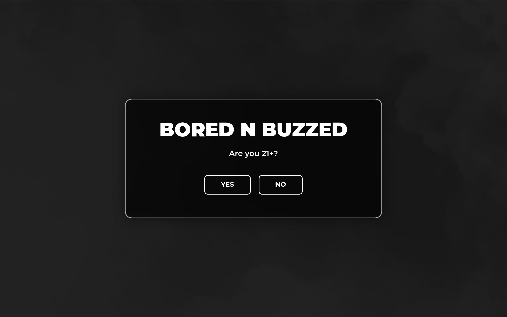

# borednbuzzed DESIGN.md

> Auto-generated design system — reverse-engineered via static analysis by skillui.
> Frameworks: None detected
> Colors: 20 · Fonts: 3 · Components: 8
> Icon library: not detected · State: not detected
> Primary theme: dark · Dark mode toggle: no · Motion: expressive

## Visual Reference

**Match this design exactly** — study colors, fonts, spacing, and component shapes before writing any UI code.



---

## 1. Visual Theme & Atmosphere

This is a **dark-themed** interface with a warm tone. Depth is expressed through layered shadows and subtle surface color variation. Typography pairs **Montserrat** for display/headings with **Open Sans** for body text, creating clear visual hierarchy through type contrast. Spacing follows a **4px base grid** (compact density), with scale: 2, 4, 6, 8, 10, 12, 14, 16px. The accent color **#ffd10b** anchors interactive elements (buttons, links, focus rings). Motion is expressive — spring physics, layout animations, and staggered reveals are part of the visual language.

---

## 2. Color Palette & Roles

| Token | Hex | Role | Use |
|---|---|---|---|
| swiper-preloader-color | `#000000` | background | Page background, darkest surface |
| swiper-preloader-color | `#ffffff` | text-primary | Headings and body text |
| e-global-color-secondary | `#222222` | text-muted | Captions, placeholders, secondary info |
| text-muted | `#808285` | text-muted | Captions, placeholders, secondary info |
| border | `#3a3a3a` | border | Dividers, card borders, outlines |
| e-global-color-accent | `#ffd10b` | accent | CTAs, links, focus rings, active states |
| danger | `#d9534f` | danger | Error states, destructive actions |
| success | `#5cb85c` | success | Success states, positive indicators |
| info | `#0274be` | info | Informational highlights |
| ast-global-color-8 | `#111111` | unknown | Palette color |
| e-global-color-primary | `#f1f1f1` | unknown | Palette color |
| unknown | `#003399` | unknown | Palette color |
| ast-global-color-6 | `#cccccc` | unknown | Palette color |
| ast-search-border-color | `#e6e6e6` | unknown | Palette color |
| unknown | `#69727d` | unknown | Palette color |
| unknown | `#3f444b` | unknown | Palette color |
| e-global-color-text | `#155b39` | unknown | Palette color |
| unknown | `#b3b3b3` | unknown | Palette color |
| unknown | `#666666` | unknown | Palette color |
| unknown | `#21759b` | unknown | Palette color |

### CSS Variable Tokens

```css
--border-radius: 0;
--border-top-width: 0px;
--border-right-width: 0px;
--border-bottom-width: 0px;
--border-left-width: 0px;
--border-style: initial;
--border-color: initial;
--border-block-start-width: var(--border-top-width);
--border-block-end-width: var(--border-bottom-width);
--border-inline-start-width: var(--border-left-width);
--border-inline-end-width: var(--border-right-width);
--border-inline-start-width: var(--border-right-width);
--border-inline-end-width: var(--border-left-width);
--e-global-color-primary: #F8F7F2;
--e-global-color-secondary: #2C2A29;
--e-global-color-accent: #FFD10B;
--e-global-typography-primary-font-family: "Roboto";
--e-global-typography-primary-font-weight: 600;
--e-global-typography-secondary-font-family: "Roboto Slab";
--e-global-typography-secondary-font-weight: 400;
```


---

## 3. Typography Rules

**Font Stack:**
- **Open Sans** — Heading 1, Heading 2, Heading 3
- **Montserrat** — Body, Caption
- **Courier 10 Pitch** — Code

**Font Sources:**

```css
@font-face {
  font-family: "Montserrat";
  src: url("fonts/Montserrat-Bold.ttf") format("truetype");
  font-weight: 700;
}
@font-face {
  font-family: "Montserrat";
  src: url("fonts/Montserrat-Regular.ttf") format("truetype");
  font-weight: 400;
}
@font-face {
  font-family: "Roboto";
  src: url("fonts/Roboto-Bold.ttf") format("truetype");
  font-weight: 700;
}
@font-face {
  font-family: "Roboto";
  src: url("fonts/Roboto-Regular.ttf") format("truetype");
  font-weight: 400;
}
@font-face {
  font-family: "Roboto Slab";
  src: url("fonts/RobotoSlab-Bold.ttf") format("truetype");
  font-weight: 700;
}
@font-face {
  font-family: "Roboto Slab";
  src: url("fonts/RobotoSlab-Regular.ttf") format("truetype");
  font-weight: 400;
}
@font-face {
  font-family: "Open Sans";
  src: url("fonts/OpenSans-Bold.ttf") format("truetype");
  font-weight: 700;
}
@font-face {
  font-family: "Open Sans";
  src: url("fonts/OpenSans-Regular.ttf") format("truetype");
  font-weight: 400;
}
@font-face {
  font-family: "swiper-icons";
  src: url("data:application/font-woff;charset=utf-8;base64, d09GRgABAAAAAAZgABAAAAAADAAAAAAAAAAAAAAAAAAAAAAAAAAAAAAAAABGRlRNAAAGRAAAABoAAAAci6qHkUdERUYAAAWgAAAAIwAAACQAYABXR1BPUwAABhQAAAAuAAAANuAY7+xHU1VCAAAFxAAAAFAAAABm2fPczU9TLzIAAAHcAAAASgAAAGBP9V5RY21hcAAAAkQAAACIAAABYt6F0cBjdnQgAAACzAAAAAQAAAAEABEBRGdhc3AAAAWYAAAACAAAAAj//wADZ2x5ZgAAAywAAADMAAAD2MHtryVoZWFkAAABbAAAADAAAAA2E2+eoWhoZWEAAAGcAAAAHwAAACQC9gDzaG10eAAAAigAAAAZAAAArgJkABFsb2NhAAAC0AAAAFoAAABaFQAUGG1heHAAAAG8AAAAHwAAACAAcABAbmFtZQAAA/gAAAE5AAACXvFdBwlwb3N0AAAFNAAAAGIAAACE5s74hXjaY2BkYGAAYpf5Hu/j+W2+MnAzMYDAzaX6QjD6/4//Bxj5GA8AuRwMYGkAPywL13jaY2BkYGA88P8Agx4j+/8fQDYfA1AEBWgDAIB2BOoAeNpjYGRgYNBh4GdgYgABEMnIABJzYNADCQAACWgAsQB42mNgYfzCOIGBlYGB0YcxjYGBwR1Kf2WQZGhhYGBiYGVmgAFGBiQQkOaawtDAoMBQxXjg/wEGPcYDDA4wNUA2CCgwsAAAO4EL6gAAeNpj2M0gyAACqxgGNWBkZ2D4/wMA+xkDdgAAAHjaY2BgYGaAYBkGRgYQiAHyGMF8FgYHIM3DwMHABGQrMOgyWDLEM1T9/w8UBfEMgLzE////P/5//f/V/xv+r4eaAAeMbAxwIUYmIMHEgKYAYjUcsDAwsLKxc3BycfPw8jEQA/gZBASFhEVExcQlJKWkZWTl5BUUlZRVVNXUNTQZBgMAAMR+E+gAEQFEAAAAKgAqACoANAA+AEgAUgBcAGYAcAB6AIQAjgCYAKIArAC2AMAAygDUAN4A6ADyAPwBBgEQARoBJAEuATgBQgFMAVYBYAFqAXQBfgGIAZIBnAGmAbIBzgHsAAB42u2NMQ6CUAyGW568x9AneYYgm4MJbhKFaExIOAVX8ApewSt4Bic4AfeAid3VOBixDxfPYEza5O+Xfi04YADggiUIULCuEJK8VhO4bSvpdnktHI5QCYtdi2sl8ZnXaHlqUrNKzdKcT8cjlq+rwZSvIVczNiezsfnP/uznmfPFBNODM2K7MTQ45YEAZqGP81AmGGcF3iPqOop0r1SPTaTbVkfUe4HXj97wYE+yNwWYxwWu4v1ugWHgo3S1XdZEVqWM7ET0cfnLGxWfkgR42o2PvWrDMBSFj/IHLaF0zKjRgdiVMwScNRAoWUoH78Y2icB/yIY09An6AH2Bdu/UB+yxopYshQiEvnvu0dURgDt8QeC8PDw7Fpji3fEA4z/PEJ6YOB5hKh4dj3EvXhxPqH/SKUY3rJ7srZ4FZnh1PMAtPhwP6fl2PMJMPDgeQ4rY8YT6Gzao0eAEA409DuggmTnFnOcSCiEiLMgxCiTI6Cq5DZUd3Qmp10vO0LaLTd2cjN4fOumlc7lUYbSQcZFkutRG7g6JKZKy0RmdLY680CDnEJ+UMkpFFe1RN7nxdVpXrC4aTtnaurOnYercZg2YVmLN/d/gczfEimrE/fs/bOuq29Zmn8tloORaXgZgGa78yO9/cnXm2BpaGvq25Dv9S4E9+5SIc9PqupJKhYFSSl47+Qcr1mYNAAAAeNptw0cKwkAAAMDZJA8Q7OUJvkLsPfZ6zFVERPy8qHh2YER+3i/BP83vIBLLySsoKimrqKqpa2hp6+jq6RsYGhmbmJqZSy0sraxtbO3sHRydnEMU4uR6yx7JJXveP7WrDycAAAAAAAH//wACeNpjYGRgYOABYhkgZgJCZgZNBkYGLQZtIJsFLMYAAAw3ALgAeNolizEKgDAQBCchRbC2sFER0YD6qVQiBCv/H9ezGI6Z5XBAw8CBK/m5iQQVauVbXLnOrMZv2oLdKFa8Pjuru2hJzGabmOSLzNMzvutpB3N42mNgZGBg4GKQYzBhYMxJLMlj4GBgAYow/P/PAJJhLM6sSoWKfWCAAwDAjgbRAAB42mNgYGBkAIIbCZo5IPrmUn0hGA0AO8EFTQAA");
  font-weight: 400;
}
```

| Role | Font | Size | Weight |
|---|---|---|---|
| Heading 1 | Open Sans | 100px | 700 |
| Heading 2 | Open Sans | 6rem | 700 |
| Heading 3 | Open Sans | 82px | 700 |
| Body | Montserrat | 16px | 400 |
| Caption | Montserrat | 15px | 400 |
| Code | Courier 10 Pitch | 14px | 400 |

**Typographic Rules:**
- Limit to 3 font families max per screen
- Use **Open Sans** for body/UI text, **Montserrat** for display/headings
- Maintain consistent hierarchy: no more than 3-4 font sizes per screen
- Headings use bold (600-700), body uses regular (400)
- Line height: 1.5 for body text, 1.2 for headings
- Use color and opacity for secondary hierarchy, not additional font sizes


---

## 4. Component Stylings

### Layout (1)

**Footer** — `html`

### Navigation (1)

**Navigation** — `html`

### Data Display (2)

**Badge** — `html`

**List** — `html`

### Data Input (1)

**Button** — `html`
- Animation: 

### Media (3)

**Image** — `html`

**Icon** — `html`

**Map/Canvas** — `html`


---

## 5. Layout Principles

- **Base spacing unit:** 4px
- **Spacing scale:** 2, 4, 6, 8, 10, 12, 14, 16, 18, 20, 24, 26
- **Border radius:** .5rem, 2px, 3px, 4px, 5px, 6px, 8px, 10%, 10px, 13.6px, 18px, 27.2px, 50px, 100%, 999px
- **Max content width:** 1000px

**Spacing as Meaning:**
| Spacing | Use |
|---|---|
| 4-8px | Tight: related items within a group |
| 12-16px | Medium: between groups |
| 24-32px | Wide: between sections |
| 48px+ | Vast: major section breaks |


---

## 6. Depth & Elevation

### Flat — subtle depth hints

- `0 0 2px 2px rgba(0,0,0,.6)`
- `0 0 1px 1px rgba(0,0,0,.2)`
- `0 0 2px 2px rgba(0,0,0,.2)`

### Raised — cards, buttons, interactive elements

- `2.6px 2.6px .4px #ccc,0 0 2.6px #d9d9d9`
- `0 0 0 rgba(255,221,0,.37),0 0 0 rgba(255,224,26,.37)`
- `var(--wndb--shadow--xs)`

### Floating — dropdowns, popovers, modals

- `0 4px 10px -2px rgba(0,0,0,.1)`
- `6px 6px 20px rgba(0,0,0,.2)`

### Overlay — full-screen overlays, top-level dialogs

- `0 0 30px rgba(0,0,0,0.4)`

### Z-Index Scale

`0, 1, 2, 3, 4, 9, 10, 11, 12, 13, 50, 99, 9997, 99999, 100000, 999999`


---

## 7. Animation & Motion

This project uses **expressive motion**. Animations are an integral part of the experience.

### CSS Animations

- `@keyframes eicon-spin`
- `@keyframes hide-scroll`
- `@keyframes fadeInUp`
- `@keyframes swiper-preloader-spin`
- `@keyframes scroll-slider-slide`

### Animated Components

- **Button**: 

### Motion Guidelines

- Duration: 150-300ms for micro-interactions, 300-500ms for page transitions
- Easing: `ease-out` for enters, `ease-in` for exits
- Always respect `prefers-reduced-motion`


---

## 8. Do's and Don'ts

### Do's

- Use `#ffd10b` for interactive elements (buttons, links, focus rings)
- Use `#000000` as the primary page background
- Pair **Open Sans** (body) with **Montserrat** (display) — these are the only allowed fonts
- Follow the **4px** spacing grid for all margins, padding, and gaps
- Use the defined shadow tokens for elevation — see Section 6
- Use border-radius from the scale: .5rem, 2px, 3px, 4px, 5px
- Reuse existing components from Section 4 before creating new ones

### Don'ts

- Don't introduce colors outside this palette — extend the design tokens first
- Don't introduce additional font families beyond Open Sans and Montserrat and Courier 10 Pitch
- Don't use arbitrary spacing values — stick to multiples of 4px
- Don't create custom box-shadow values outside the system tokens
- Don't use arbitrary border-radius values — pick from the defined scale
- Don't duplicate component patterns — check Section 4 first
- Don't use backdrop-blur or blur effects

### Anti-Patterns (detected from codebase)

- No blur or backdrop-blur effects
- No zebra striping on tables/lists


---

## 9. Responsive Behavior

| Name | Value | Source |
|---|---|---|
| xs | 420px | css |
| xs | 421px | css |
| xs | 479px | css |
| sm | 543px | css |
| sm | 544px | css |
| sm | 600px | css |
| md | 767px | css |
| md | 768px | css |
| lg | 769px | css |
| lg | 782px | css |
| lg | 921px | css |
| lg | 921.9px | css |
| lg | 922px | css |
| lg | 992px | css |
| lg | 993px | css |
| lg | 1024px | css |
| xl | 1025px | css |
| xl | 1200px | css |
| xl | 1201px | css |
| 2xl | 99999px | css |

**Approach:** Use `@media (min-width: ...)` queries matching the breakpoints above.


---

## 10. Agent Prompt Guide

Use these as starting points when building new UI:

### Build a Card

```
Background: #000000
Border: 1px solid #3a3a3a
Radius: 10%
Padding: 16px
Font: Open Sans
Use shadow tokens from Section 6.
```

### Build a Button

```
Primary: bg #ffd10b, text white
Ghost: bg transparent, border #3a3a3a
Padding: 8px 16px
Radius: 10%
Hover: opacity 0.9 or lighter shade
Focus: ring with #ffd10b
```

### Build a Page Layout

```
Background: #000000
Max-width: 1000px, centered
Grid: 4px base
Responsive: mobile-first, breakpoints from Section 9
```

### Build a Stats Card

```
Surface: #000000
Label: #222222 (muted, 12px, uppercase)
Value: #ffffff (primary, 24-32px, bold)
Status: use success/warning/danger from Section 2
```

### Build a Form

```
Input bg: #000000
Input border: 1px solid #3a3a3a
Focus: border-color #ffd10b
Label: #222222 12px
Spacing: 16px between fields
Radius: 10%
```

### General Component

```
1. Read DESIGN.md Sections 2-6 for tokens
2. Colors: only from palette
3. Font: Open Sans, type scale from Section 3
4. Spacing: 4px grid
5. Components: match patterns from Section 4
6. Elevation: shadow tokens
```
